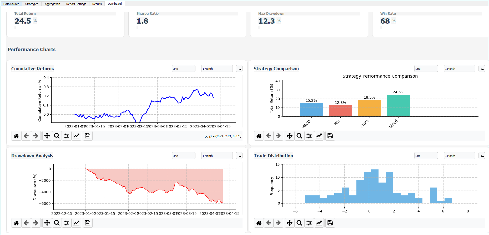

# Trading Strategy Aggregation System

A Python-based system for aggregating signals from multiple trading strategies to generate unified trading decisions with an interactive GUI dashboard.

## Overview

This system allows you to combine signals from different technical analysis strategies with customizable weights to create a more robust trading approach. It includes data loading from various sources, strategy implementation, signal aggregation, and comprehensive reporting with interactive visualizations.

## Features

- **Interactive GUI Dashboard**: User-friendly interface for configuring and visualizing trading strategies
- **Data Loading**: Load market data from CSV files, Yahoo Finance, Alpha Vantage, or generate sample data
- **Multiple Strategies**: Includes implementations for:
  - Moving Average Crossover
  - Relative Strength Index (RSI)
  - Moving Average Convergence Divergence (MACD)
  - Bollinger Bands
  - Fibonacci Retracement
  - Ichimoku Cloud
  - Volume Profile
- **Signal Aggregation**: Combine signals using weighted average, majority vote, or consensus methods
- **Advanced Visualizations**: Interactive charts and performance metrics visualization
- **Reporting**: Generate HTML or CSV reports with performance metrics and visualizations
- **Configuration Management**: Save and load strategy configurations for reuse

## Project Structure

```
├── aggregator/
│   └── signal_aggregator.py    # Signal aggregation logic
├── data/
│   └── data_loader.py          # Data loading from various sources
├── reports/
│   └── report_generator.py     # Report generation and visualization
├── strategies/
│   ├── strategy_interface.py   # Strategy base class
│   ├── strategy_factory.py     # Factory for creating strategies
│   ├── moving_average_crossover.py
│   ├── rsi_strategy.py
│   ├── macd_strategy.py
│   ├── bollinger_bands_strategy.py
│   ├── fibonacci_retracement_strategy.py
│   ├── ichimoku_cloud_strategy.py
│   └── volume_profile_strategy.py
├── gui/
│   ├── components/             # GUI components
│   ├── controllers/            # GUI controllers
│   ├── assets/                 # GUI assets
│   └── main_window.py          # Main GUI window
├── config/
│   └── config.json             # Configuration file (created on first run)
├── logs/                       # Log files directory
├── main.py                     # CLI application entry point
├── gui_app.py                  # GUI application entry point
└── requirements.txt            # Project dependencies
```

## Installation

1. Clone the repository
2. Install dependencies:

```bash
pip install -r requirements.txt
```

## Usage

### GUI Application

Launch the GUI application for an interactive experience:

```bash
python gui_app.py
```

The GUI provides:
- Data source configuration
- Strategy management with custom parameters
- Aggregation settings
- Interactive visualizations
- Configuration management

### Command Line Usage

Run the application with default settings:

```bash
python main.py
```

This will:
1. Load sample market data
2. Process it with the default strategies
3. Aggregate the signals
4. Generate an HTML report with visualizations

### Configuration

On first run, a default configuration file will be created at `config/config.json`. You can modify this file to:

- Change data sources
- Adjust strategy parameters
- Modify aggregation methods
- Configure report formats

To save the default configuration explicitly:

```bash
python main.py --save-config
```

To use a custom configuration file:

```bash
python main.py --config path/to/your/config.json
```

## Available Strategies

### Moving Average Crossover
Generates signals based on the crossing of short and long-term moving averages.

### RSI (Relative Strength Index)
Identifies overbought and oversold conditions using the RSI indicator.

### MACD (Moving Average Convergence Divergence)
Generates signals based on the MACD line crossing the signal line.

### Bollinger Bands
Identifies potential reversals when price touches or crosses the bands.

### Fibonacci Retracement
Identifies potential support and resistance levels based on Fibonacci ratios.

### Ichimoku Cloud
Comprehensive indicator providing support/resistance, trend direction, and momentum signals.

### Volume Profile
Analyzes trading volume at specific price levels to identify significant support/resistance zones.

## Dashboard Functionality

The interactive dashboard provides:

- **Market Data View**: Visualize price and volume data
- **Strategy Signals**: View buy/sell signals from individual strategies
- **Aggregated Signals**: See the combined signals with configurable weights
- **Performance Metrics**: Track key metrics like win rate, profit factor, and drawdown
- **Configuration Panel**: Easily adjust strategy parameters and weights
- **Backtesting**: Test strategies against historical data

## Adding New Strategies

To add a new strategy:

1. Create a new Python file in the `strategies/` directory
2. Implement a class that inherits from `Strategy` base class
3. Register the strategy in `strategy_factory.py`
4. Add the strategy to your configuration


